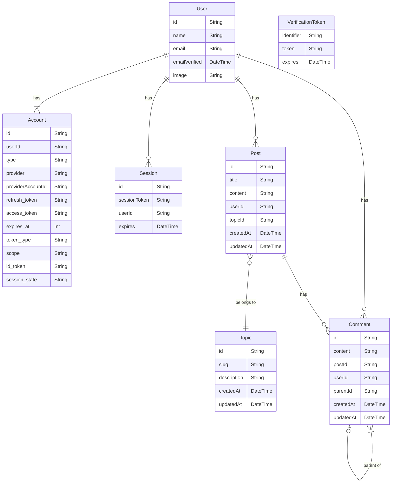

```mermaid
erDiagram
    User {
        id String
        name String
        email String
        emailVerified DateTime
        image String
    }


    Account {
        id String
        userId String
        type String
        provider String
        providerAccountId String
        refresh_token String
        access_token String
        expires_at Int
        token_type String
        scope String
        id_token String
        session_state String
    }

    Session {
        id String
        sessionToken String
        userId String
        expires DateTime
    }

    VerificationToken {
        identifier String
        token String
        expires DateTime
    }

    Topic {
        id String
        slug String
        description String
        createdAt DateTime
        updatedAt DateTime
    }

    Post {
        id String
        title String
        content String
        userId String
        topicId String
        createdAt DateTime
        updatedAt DateTime
    }

    Comment {
        id String
        content String
        postId String
        userId String
        parentId String
        createdAt DateTime
        updatedAt DateTime
    }

    User ||--|{ Account : "has"
    User ||--o{ Session : "has"
    User ||--o{ Post : "has"
    User ||--o{ Comment : "has"
    Post ||--o{ Comment : "has"
    Post }o--|| Topic : "belongs to"
    Comment }|--o| Comment : "parent of"

```
